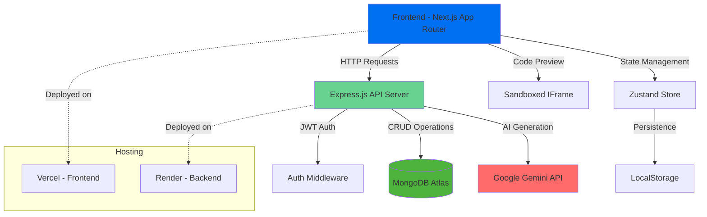

# PromptUI

A full-stack AI-powered UI code generation platform that transforms natural language prompts into interactive React components. Built with Next.js, Express.js, MongoDB, and Google Gemini AI.

[](https://prompt-ui-ten.vercel.app)
[](https://promptui-backend.onrender.com)
[](LICENSE)

---

## 🚀 Live Demo
Please once open the backend url in your browser to ensure the API is running before using the frontend.
This is done because the backend is hosted on Render, which may take a few moments to start up and shut down automatically after a while.
- **Frontend (Vercel):** [https://prompt-ui-ten.vercel.app/](https://prompt-ui-ten.vercel.app/)
- **Backend API (Render):** [https://promptui.onrender.com/](https://promptui.onrender.com/)

---

## ✨ Features

- 🤖 **AI-Powered Code Generation** - Transform natural language into React components using Google Gemini
- 🎨 **Live Preview** - Real-time sandboxed preview of generated components
- 💾 **Project Management** - Create, save, and manage multiple UI projects
- 🔐 **User Authentication** - Secure JWT-based authentication system
- 📱 **Responsive Design** - Works seamlessly across desktop 
- 🌙 **Modern UI** - Clean interface built with Tailwind CSS 
- ⚡ **Fast Development** - Hot-reload development environment

---

## 🏗️ Architecture Diagram



---

## 🗂️ State Management & Persistence Strategy

### Frontend State Management (Zustand)

- **Authentication Store (`auth.store.ts`)**
  - Manages user authentication state (token, user info)
  - Persisted to localStorage using Zustand's `persist` middleware
  - Automatic session restoration on app reload

- **Project Store (`project.store.ts`)**
  - Handles project CRUD operations
  - Manages active project state and chat history
  - Synchronizes with backend API for real-time updates

### Backend Persistence (MongoDB)

- **User Model**: Stores user credentials and profile information
- **Project Model**: Contains project metadata, chat history, and generated code
- **Database Strategy**: MongoDB Atlas for scalable, cloud-hosted persistence

### Data Flow Architecture

```
User Action → Zustand Store → API Request → Express Controller → MongoDB → Response → Store Update → UI Refresh
```

---

## ⚙️ Key Decisions & Trade-offs

### 1. **Sandboxing Approach**
- **Decision**: Isolated iframe for code preview
- **Rationale**: Prevents XSS attacks and provides secure code execution
- **Trade-off**: Limited parent-child communication vs enhanced security

### 2. **Auto-save Logic**
- **Decision**: Manual save on user actions (not time-based)
- **Rationale**: Reduces API calls and prevents data conflicts
- **Trade-off**: Risk of data loss vs performance optimization

### 3. **AI Integration Strategy**
- **Decision**: Backend-proxied AI requests
- **Rationale**: Keeps API keys secure and enables request monitoring
- **Trade-off**: Additional latency vs security compliance

### 4. **Authentication Approach**
- **Decision**: JWT with localStorage persistence
- **Rationale**: Stateless authentication with seamless UX
- **Trade-off**: XSS vulnerability vs performance and simplicity

### 5. **Hosting Strategy**
- **Frontend (Vercel)**: Edge deployment for global performance
- **Backend (Render)**: Managed Node.js with persistent connections
- **Database (MongoDB Atlas)**: Cloud-native with automatic scaling

---

## 🛠️ Tech Stack

### Frontend
- **Framework**: Next.js
- **Styling**: Tailwind CSS
- **State Management**: Zustand
- **Code Editor**: React Simple Code Editor with Prism.js
- **HTTP Client**: Axios
- **TypeScript**: Full type safety

### Backend
- **Runtime**: Node.js
- **Framework**: Express.js
- **Database**: MongoDB with Mongoose ODM
- **Authentication**: JWT + bcryptjs
- **AI Integration**: Google Gemini API
- **Security**: CORS, input validation

### DevOps & Hosting
- **Frontend**: Vercel
- **Backend**: Render (Managed Node.js)
- **Database**: MongoDB Atlas (Cloud)
- **Version Control**: Git + GitHub


---

## 🚀 Local Development Setup

### Prerequisites
- Node.js 18+ and npm
- MongoDB (local or Atlas)
- Google Gemini API key


### Environment Variables

**Backend (`.env`)**
```env
MONGODB_URI=mongodb://localhost:27017/promptui
JWT_SECRET=your-secret-key
GEMINI_API_KEY=your-gemini-api-key
PORT=5001
```

**Frontend (`.env.local`)**
```env
NEXT_PUBLIC_API_URL=http://localhost:5001/api
```

---

## 📋 API Documentation

### Authentication Endpoints
- `POST /api/users/register` - User registration
- `POST /api/users/login` - User login

### Project Endpoints
- `GET /api/projects` - List user projects
- `POST /api/projects` - Create new project
- `POST /api/projects/generate` - Generate component code

---
## 🤝 Contributing

1. Fork the repository
2. Create a feature branch (`git checkout -b feature/amazing-feature`)
3. Commit your changes (`git commit -m 'Add amazing feature'`)
4. Push to the branch (`git push origin feature/amazing-feature`)
5. Open a Pull Request

---

## 📄 License

This project is licensed under the MIT License - see the [LICENSE](LICENSE) file for details.

---

## 👨‍💻 Author

[@iamskpandey](https://github.com/iamskpandey)

---

## 🙏 Acknowledgments

- Google Gemini AI for powerful code generation
- Vercel for seamless frontend hosting
- Render for reliable backend infrastructure
- The open-source community for amazing tools and libraries